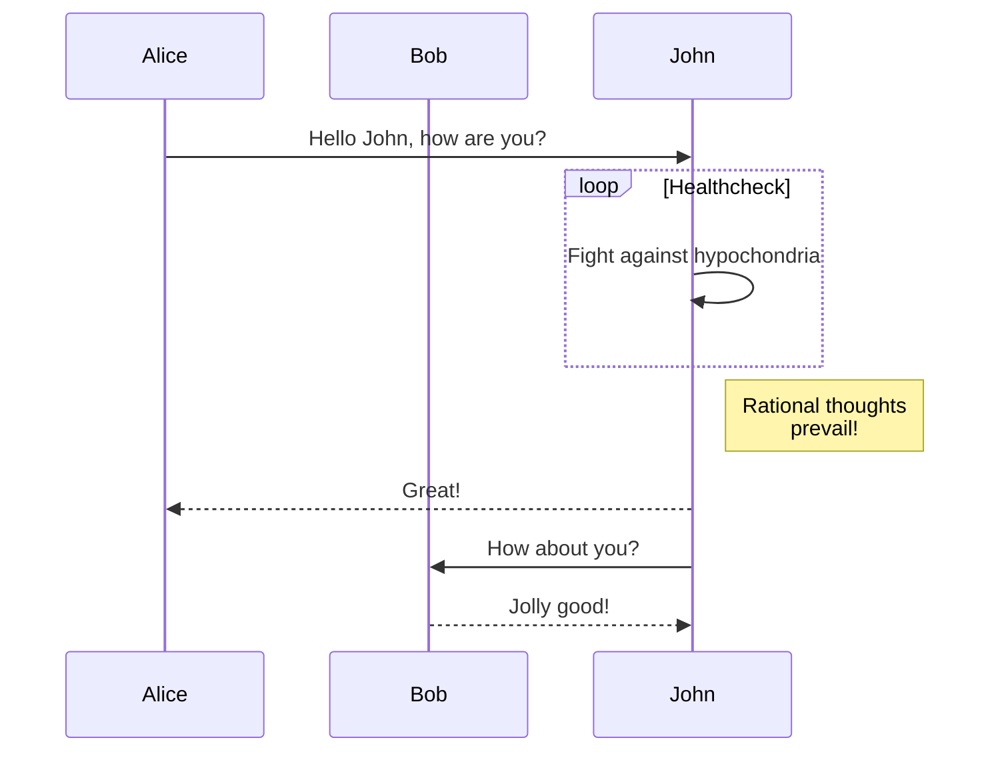
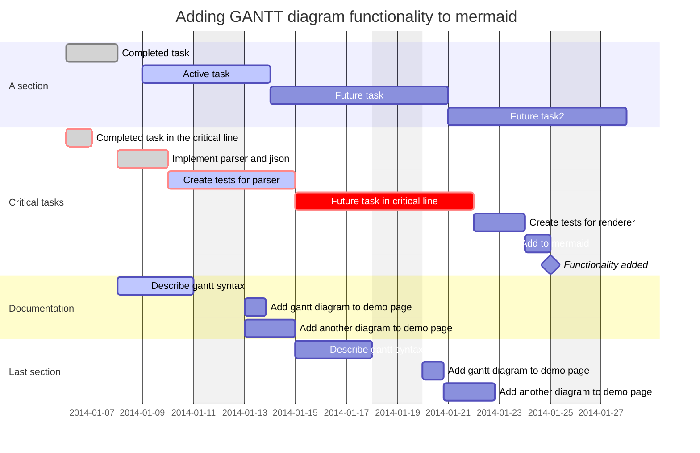

[Исходные файлы в формете .dt в assets к релизу или перейдите по ссылке и в самом низу](https://github.com/antonkuklin006/1C_Enterprise_8/releases/tag/Beta)
   

# Этот репозиторий преднозначен для руководителей проектов IT. 
> Проектный менеджер играющий отдельно от команды - обречен, на провал. Как и его проекты....
©Джон Дорр

## Твои основные дашборды на этапе разработки:
- [Планирование этапов](https://clck.ru/382PaF)
- [Задачи](https://clck.ru/382PsR)
- [Дорожная карта](https://clck.ru/382Qo3)

## Твои основные дашборды на этапе тестирования, на стороне заказчика:
- [Help desk](https://github.com/users/antonkuklin006/projects/2/views/7)
- [Ticket system](https://github.com/users/antonkuklin006/projects/2/views/8)
- [Bug tracker](https://github.com/users/antonkuklin006/projects/2/views/9)

## Что должен понимать:
- [Стэк](https://clck.ru/382KNk)
- [CI\CD](https://clck.ru/382PsR)
- [Клиент-серверная архетектура](https://clck.ru/382Qo3)
- [Бизнес-процессы](https://clck.ru/382Qo3)

## Документация (может изменяться: количеству, содержанию): 
- [Project Charter (Устав проекта)](https://clck.ru/382NPz)
- [Project Management Plan (План управления проектом)](https://clck.ru/382MwW)
- [Work Breakdown Structure (Разработка структуры проекта)](https://clck.ru/382NPz)
- [Risk Register (Реестр рисков)](https://clck.ru/382MwW)
- [Communication Plan (План коммуникаций)](https://clck.ru/382NPz)
- [Resource Management Plan (План управления ресурсами)](https://clck.ru/382MwW)
- [Stakeholder Register (Реестр заинтересованных сторон)](https://clck.ru/382NPz)
- [Change Management Plan (План управления изменениями)](https://clck.ru/382MwW)
- [Cost Management Plan (План управления затратами)](https://clck.ru/382NPz)
- [Scope Management Plan (План управления объемом работ)](https://clck.ru/382MwW)
- [Stakeholder Communication Plan (План коммуникации с заинтересованными сторонами)](https://clck.ru/382NPz)
- [Performance Reports (Отчеты о выполнении)](https://clck.ru/382MwW)
- [Risk Management Plan (План управления рисками)](https://clck.ru/382NPz)
- [Human Resource Management Plan (План управления человеческими ресурсами)](https://clck.ru/382MwW)
- [Project Archive (Архив проекта)](https://clck.ru/382NPz)
- [Project Closeout Report (Отчет о завершении проекта)](https://clck.ru/382MwW)

## Твои основные вопросы: 
- [Важность и приоритеты?](https://clck.ru/382NPz)
- [А что с бизнес-процессом?](https://clck.ru/382MwW)

- [Будем делать Ганнта?](https://clck.ru/382MwW)

## Описание/мануал релиза:

