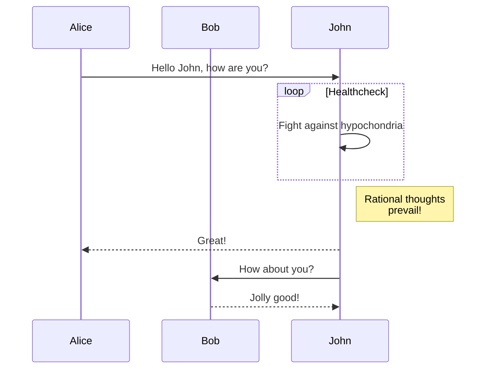

# Этот репозиторий преднозначен для руководителей проектов IT. 
> Проектный менеджер играющий отдельно от команды - обречен, на провал. Как и его проекты....
©Джон Дорр 

## Твои основные дашборды на этапе разработки:
- [Планирование этапов](https://clck.ru/382PaF)
- [Задачи](https://clck.ru/382PsR)
- [Дорожная карта](https://clck.ru/382Qo3)

## Твои основные дашборды на этапе тестирования, на стороне заказчика:
- [Help desk](https://github.com/users/antonkuklin006/projects/2/views/7)
- [Ticket system ](https://github.com/users/antonkuklin006/projects/2/views/8)
- [Bug tracker]([https://clck.ru/382Qo3](https://github.com/users/antonkuklin006/projects/2/views/9))

## Что должен понимать:
- [Стэк](https://clck.ru/382KNk)
- [CI\CD](https://clck.ru/382PsR)
- [Клиент-серверная архетектура](https://clck.ru/382Qo3)
- [Бизнес-процессы](https://clck.ru/382Qo3)

## Документация (может изменяться: количеству, содержанию) 
<li> <a class="link-6" href="https://clck.ru/382NPz">Project Charter (Устав проекта)</a> </li>
<li> <a class="link-7" href="https://clck.ru/382MwW">Project Management Plan (План управления проектом)</a> </li>
<li> <a class="link-6" href="https://clck.ru/382NPz">Work Breakdown Structure (Разработка структуры проекта)</a> </li>
<li> <a class="link-7" href="https://clck.ru/382MwW">Risk Register (Реестр рисков)</a> </li>
<li> <a class="link-6" href="https://clck.ru/382NPz">Communication Plan (План коммуникаций)</a> </li>
<li> <a class="link-7" href="https://clck.ru/382MwW">Resource Management Plan (План управления ресурсами)</a> </li>
<li> <a class="link-6" href="https://clck.ru/382NPz">Stakeholder Register (Реестр заинтересованных сторон)</a> </li>
<li> <a class="link-7" href="https://clck.ru/382MwW">Change Management Plan (План управления изменениями)</a> </li>
<li> <a class="link-6" href="https://clck.ru/382NPz">Cost Management Plan (План управления затратами)</a> </li>
<li> <a class="link-7" href="https://clck.ru/382MwW">Scope Management Plan (План управления объемом работ)</a> </li>
<li> <a class="link-6" href="https://clck.ru/382NPz">Stakeholder Communication Plan (План коммуникации с заинтересованными сторонами)</a> </li>
<li> <a class="link-7" href="https://clck.ru/382MwW">Performance Reports (Отчеты о выполнении)</a> </li>
<li> <a class="link-6" href="https://clck.ru/382NPz">Risk Management Plan (План управления рисками)</a> </li>
<li> <a class="link-7" href="https://clck.ru/382MwW">Human Resource Management Plan (План управления человеческими ресурсами)</a> </li>
<li> <a class="link-6" href="https://clck.ru/382NPz">Project Archive (Архив проекта)</a> </li>
<li> <a class="link-7" href="https://clck.ru/382MwW">Project Closeout Report (Отчет о завершении проекта)</a> </li>

## Твои основные вопросы: 
<li> <a class="link-6" href="https://clck.ru/382NPz">Важность и приоритеты?</a> </li>
<li> <a class="link-7" href="https://clck.ru/382MwW">А что с бизнес-процессом?</a> </li>

